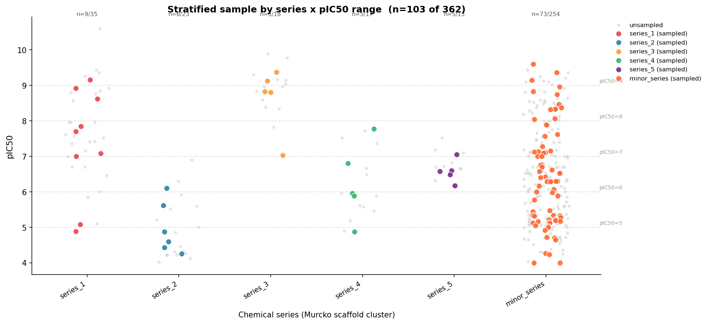

# stratosampler


**Stratified molecular dataset splitting for QSAR model development.**

[](https://www.python.org)
[](LICENSE)
[]()

---

## The problem with naive splits

When you build a QSAR model, the way you split your dataset determines how honestly you evaluate it.

A standard random `train_test_split` gives you a test set that *happens* to look like the training set — because it was drawn from the same distribution. This inflates your metrics. You think your model generalises to diverse chemical space. It doesn't.

```
Full dataset     →  logP range: -2 to 7,  MW range: 150–700
Random test set  →  logP range: -1.8 to 6.9,  MW range: 160–690  ← almost identical
```

The test set is not a real challenge. It's a mirror.

**stratosampler** fixes this by stratifying across multiple molecular properties simultaneously, so train and test sets each represent the full property distribution of your dataset — not a random slice of it.

```
Stratified test set  →  logP range: -1.9 to 6.8,  MW range: 155–685  ← intentionally representative
KS statistic (logP): 0.04 vs 0.18 for random split
```

---

## Install

```bash
pip install stratosampler
# with RDKit (required for computing properties from SMILES):
pip install "stratosampler[rdkit]"
```

---

## Quick start

```python
from stratosampler import PropertyStratifiedSplitter

splitter = PropertyStratifiedSplitter(
    properties=["MolLogP", "MolWt", "TPSA"],
    n_bins=5,
    test_size=0.2,
    random_state=42,
)

# From SMILES (computes properties automatically)
train_idx, test_idx = splitter.split(df, smiles_col="SMILES")

# From pre-computed property columns
train_idx, test_idx = splitter.split(df, property_cols=["logP", "MW", "TPSA"])

# Three-way split
train_idx, val_idx, test_idx = splitter.split(
    df, smiles_col="SMILES"
)  # set val_size > 0 in constructor

# Get DataFrames directly
train_df, test_df = splitter.get_split_dataframes(df, smiles_col="SMILES")
```

---

## Scaffold-aware mode

Prevents analogue leakage by keeping molecules sharing a Murcko scaffold
together in the same split, while still preserving property distributions
at the scaffold-cluster level.

```python
splitter = PropertyStratifiedSplitter(
    properties=["MolLogP", "MolWt", "TPSA"],
    test_size=0.2,
    scaffold_aware=True,
    random_state=42,
)
train_idx, test_idx = splitter.split(df, smiles_col="SMILES")
```

---

## Evaluate your split

```python
from stratosampler import split_summary, plot_property_distributions

summary = split_summary(df, train_idx, test_idx, property_cols=["logP", "MW", "TPSA"])

print(f"Mean KS statistic:    {summary['mean_ks_stat']:.3f}")   # lower = better
print(f"Mean JS divergence:   {summary['mean_js_div']:.3f}")    # lower = better
print(f"Stratum coverage:     {summary['coverage_score']:.3f}") # 1.0 = all strata in both splits

# Visualise distributions
fig = plot_property_distributions(df, train_idx, test_idx, ["logP", "MW", "TPSA"])
fig.savefig("split_distributions.png", dpi=150, bbox_inches="tight")
```

---

## Compare strategies

```python
from stratosampler import PropertyStratifiedSplitter, split_summary, plot_split_comparison
import numpy as np

props = ["MolLogP", "MolWt", "TPSA"]

# Random split
rng = np.random.default_rng(42)
idx = np.arange(len(df)); rng.shuffle(idx)
n_test = int(0.2 * len(df))
random_results = split_summary(df, idx[n_test:], idx[:n_test], props)

# Stratified split
strat = PropertyStratifiedSplitter(test_size=0.2, random_state=42)
train, test = strat.split(df, smiles_col="SMILES")
strat_results = split_summary(df, train, test, props)

# Scaffold-aware split
sc_strat = PropertyStratifiedSplitter(test_size=0.2, scaffold_aware=True, random_state=42)
sc_train, sc_test = sc_strat.split(df, smiles_col="SMILES")
sc_results = split_summary(df, sc_train, sc_test, props)

fig = plot_split_comparison(
    {"random": random_results, "stratified": strat_results, "scaffold+strat": sc_results},
    props,
    metric="ks_stat",
)
fig.savefig("strategy_comparison.png", dpi=150, bbox_inches="tight")
```

---

## Built-in properties

When passing `properties` to the splitter, these names are computed automatically from SMILES:

| Name | Description |
|------|-------------|
| `MolLogP` | Wildman-Crippen LogP |
| `MolWt` | Molecular weight |
| `TPSA` | Topological polar surface area |
| `NumHDonors` | H-bond donors |
| `NumHAcceptors` | H-bond acceptors |
| `NumRotBonds` | Rotatable bonds |
| `NumRings` | Total ring count |
| `NumAromaticRings` | Aromatic ring count |
| `FractionCSP3` | Fraction of sp3 carbons |
| `NumHeavyAtoms` | Heavy atom count |

Any valid `rdkit.Chem.Descriptors` attribute name also works.

---

## Why this matters for QSAR

A well-stratified split catches real model failures:

- A model trained on a random split of a logP-skewed dataset will look good on paper but fail on low-logP compounds in deployment.
- A model evaluated on a scaffold-split-only test set may miss property distribution shift — your test compounds are structurally novel but chemically similar.
- Coverage score tells you whether your test set actually challenges the model across the full property space.

The goal is not to make your model look worse — it's to catch problems before they reach the project team.

---

## Real-world example: ChEMBL EGFR kinase inhibitors

The `examples/chembl_egfr_stratified_sampling.py` script fetches 362 EGFR IC50
records from ChEMBL, clusters them into chemical series via Murcko scaffold
analysis, then draws a stratified sample across every **(series × pIC50 range)**
stratum — guaranteeing at least 5 representatives per series.



Grey dots are the full population; coloured circles are the 103 sampled
compounds (28.5%), one colour per scaffold series. Dashed lines mark pIC50
activity-range boundaries. The sample achieves KS = 0.064 on the pIC50
distribution — close to what a pure property-stratified split would give,
while also guaranteeing chemical-series coverage.

---

## Contributing

Issues and PRs welcome. Run the test suite with:

```bash
pip install -e ".[dev]"
pytest tests/ -v
```

---

## License

MIT. See [LICENSE](LICENSE).

---

## Citation

If stratosampler is useful in your research:

```
Fino, R. (2026). stratosampler: Stratified molecular dataset splitting for QSAR.
GitHub: https://github.com/rubbs14/stratosampler
```
